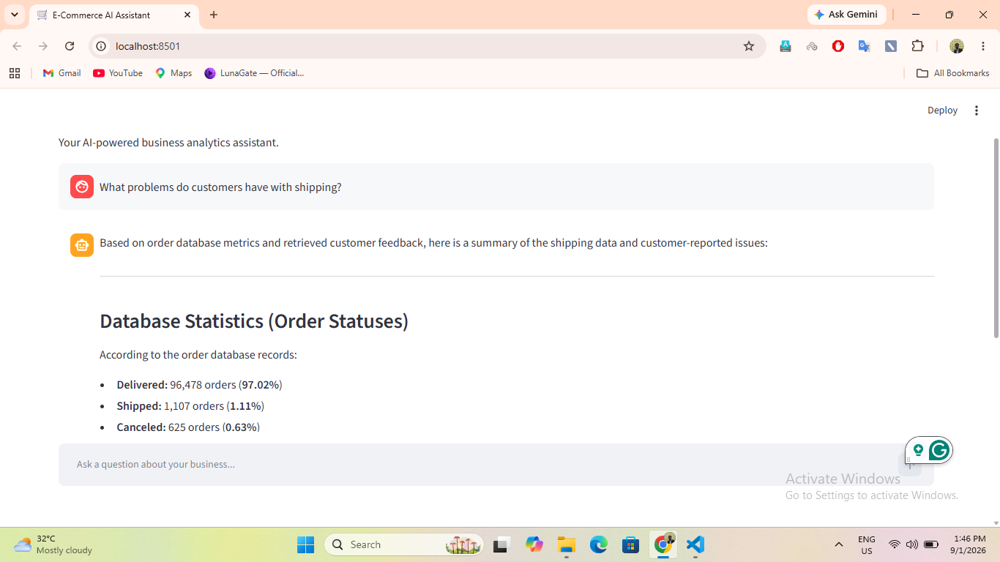
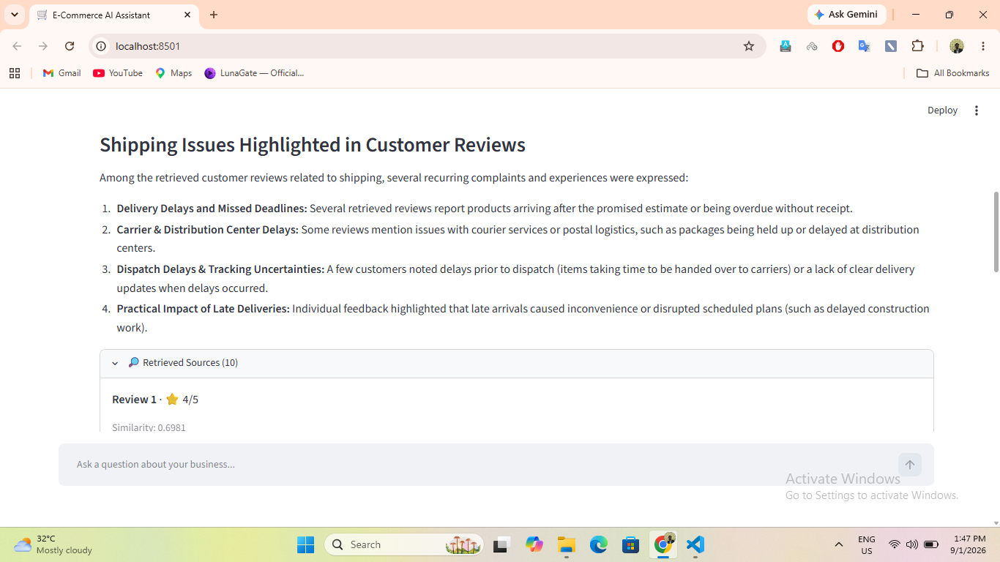

# 🛒 E-Commerce AI Assistant

A hybrid AI business analytics assistant that answers both quantitative
questions ("what happened") and qualitative questions ("why") about an
e-commerce business — using structured SQL tool-calling for hard numbers,
and retrieval-augmented generation (RAG) over real customer reviews for
sentiment and experience-based questions.

## Overview

Business stakeholders often need two different kinds of answers: precise
metrics (revenue, order status, payment trends) and human context (what are
customers actually saying?). This assistant handles both in a single
conversational interface, letting an LLM decide which data source — a SQL
query or a semantic search over reviews — is appropriate for each question,
then grounding its answer in the retrieved evidence rather than general
knowledge.

## Features

- Natural-language querying over structured e-commerce data (orders, revenue,
  payment methods, categories, states) via Gemini tool-calling
- Semantic search over 40,000+ real customer reviews using local embeddings
- Maximal Marginal Relevance (MMR) retrieval for diverse, non-redundant
  review evidence
- Retrieved review evidence displayed directly in the UI (expandable
  "Retrieved Sources" panel) — answers are traceable, not black-box
- A grounding-focused system prompt that explicitly constrains the model
  from making unsupported frequency claims or treating individual reviews
  as company-wide fact
- Single conversational interface handling both quantitative and
  qualitative questions without the user needing to specify which

## Architecture

```text
    ┌─────────────────────┐
    │       User          │
    │ Natural-language    │
    │      question      │
    └──────────┬──────────┘
    │
    ▼
    ┌─────────────────────┐
    │     Streamlit       │
    │      app.py         │
    └──────────┬──────────┘
    │
    ▼
    ┌─────────────────────┐
    │   Google Gemini     │
    │  Tool Selection &   │
    │   Answer Generation │
    └───────┬─────┬───────┘
    │     │
    ┌──────────────┘     └──────────────┐
    ▼                                   ▼
    ┌─────────────────────┐             ┌─────────────────────┐
    │ Structured Analytics│             │   Review Retrieval  │
    │      tools.py       │             │      rag.py         │
    └──────────┬──────────┘             └──────────┬──────────┘
    │                                   │
    ▼                                   ▼
    ┌─────────────────────┐             ┌─────────────────────┐
    │      DuckDB         │             │ SentenceTransformer │
    │  ecommerce.duckdb   │             │     Embeddings      │
    └─────────────────────┘             └──────────┬──────────┘
    │
    ▼
    ┌─────────────────────┐
    │       **FAISS**         │
    │ Vector Similarity   │
    │       Search        │
    └──────────┬──────────┘
    │
    ▼
    ┌─────────────────────┐
    │        **MMR**          │
    │ Diverse Review      │
    │     Selection       │
    └──────────┬──────────┘
    │
    ▼
    ┌─────────────────────┐
    │ Retrieved Reviews   │
    └──────────┬──────────┘
    │
    ▼
    ┌─────────────────────┐
    │    Gemini Answer    │
    └─────────────────────┘
```

---


## Tech Stack

| Technology            | Purpose                                            |
| --------------------- | -------------------------------------------------- |
| Python                | Application development                            |
| Streamlit             | User interface                                     |
| DuckDB                | Analytical database                                |
| Pandas                | Data manipulation                                  |
| NumPy                 | Numerical operations                               |
| FAISS                 | Vector similarity search                           |
| Sentence Transformers | Review embeddings                                  |
| Google Gemini         | Natural-language reasoning and response generation |
| python-dotenv         | Environment variable management                    |

---

## How the RAG Pipeline Works

1. The user's question is embedded locally using the same multilingual
   MiniLM model used to embed all reviews.
2. FAISS retrieves a candidate pool (`max(top_k × 5, 50)` reviews) by
   cosine similarity.
3. **MMR re-ranks the candidate pool**, balancing relevance to the question
   against similarity to reviews already selected — this reduces redundant,
   near-duplicate reviews in the final evidence set, rather than returning
   the top-K most similar reviews, which often overlap heavily in content.
4. The top `top_k` (default 8) reviews after MMR are formatted into context
   and returned to Gemini alongside their rating and similarity score.
5. Gemini answers using this context, under a system prompt that enforces
   strict grounding rules (see below).
6. The retrieved reviews are also surfaced directly in the Streamlit UI, so
   the user can inspect the evidence behind any review-based answer.

## Why FAISS + Local Embeddings + MMR, Not a Reranker

A cross-encoder reranker adds real value in large-scale production retrieval
by re-scoring candidates with a heavier, more accurate model after initial
retrieval — but it also adds a second model to load, latency per query, and
another dependency to manage. At this project's scale (a single review
corpus, not a live production search engine), the actual retrieval problem
observed wasn't relevance — FAISS's cosine similarity retrieval was already
returning genuinely relevant reviews — it was **redundancy**: near-duplicate
reviews saying the same thing crowding out a more diverse, representative
sample of evidence. MMR solves exactly this, using the embeddings already
computed, with no additional model or inference cost. A reranker would be
the right next step if retrieval *relevance* itself were the bottleneck;
here, the bottleneck was retrieval *diversity*, and MMR is the
proportionate fix.

## Grounding & Hallucination Mitigation

Early testing revealed a real risk: even with correct retrieval, the LLM
would sometimes elaborate beyond the retrieved evidence with plausible but
fabricated specifics (e.g., inventing exact product defect types not present
in any retrieved review). This was addressed with an explicit system prompt
that:

- Distinguishes structured database facts from review-based evidence
- Prohibits frequency claims ("most common", "majority") unless the
  underlying data actually supports them
- Requires hedged language when summarizing review evidence
  ("among the retrieved reviews...", not "customers commonly...")
- Explicitly instructs the model to say when available data is insufficient,
  rather than filling gaps with general knowledge

This is a known, actively-mitigated limitation rather than a solved one —
see **Known Limitations** below.

## Database

DuckDB (`data/ecommerce.duckdb`), containing e-commerce order data with the
following key tables:
- `orders` — order-level records and status
- `order_items` — line items per order, linked to products
- `order_payments` — payment method and value per order
- `products` / `categories` — product catalog and category mapping
- `customers` — customer records including state (for geographic analysis)
- `reviews` — customer review score and text per order

## Available Tools

| Tool | Purpose |
|---|---|
| `get_order_summary` | Total, delivered, cancelled, shipped order counts |
| `get_order_status_summary` | Order counts and % by status |
| `get_category_revenue` | Top revenue-generating product categories |
| `get_payment_method_summary` | Order counts and value by payment method |
| `get_revenue_by_state` | Revenue and orders by customer state |
| `get_revenue_summary` | Total revenue, orders, average order value |
| `search_reviews` | Semantic search over customer reviews (RAG) |

## Project Structure

```text ecommerce-ai-assistant/ │ ├── app.py ├── config.py ├── database.py ├── rag.py ├── tools.py │ ├── test_rag.py ├── test_gemini_rag.py │ ├── requirements.txt ├── **README**.md ├── .gitignore ├── .env │ ├── data/ │   └── ... │ ├── embeddings/ │   └── local_review_embeddings.npy │ └── ecommerce.duckdb ```

## Setup

### Environment Variables

Create a `.env` file in the project root:

GEMINI_API_KEY=your_api_key_here


### Installation

```bash
pip install -r requirements.txt
```

### Running the app

```bash
streamlit run app.py
```

## Example Questions

**Structured (SQL tool-calling):**
- "Which product categories generate the most revenue?"
- "What is the distribution of order statuses?"
- "Which states generate the most revenue?"
- "What payment methods are most commonly used?"

**RAG-based (review search):**
- "What are customers unhappy about?"
- "What delivery problems are customers reporting?"

## Screenshots



## Known Limitations & Future Improvements

- Review text is primarily in Portuguese (source dataset: Olist Brazilian
  e-commerce); the assistant handles this via a multilingual embedding
  model, but this is worth being aware of when testing.
- Retrieved reviews are a sample, not an exhaustive count — the system
  prompt enforces this framing, but this is a structural limitation of
  semantic search over a corpus this size, not something MMR or prompt
  engineering fully eliminates.
- No automated evaluation of answer groundedness yet (currently verified
  manually by comparing answers against retrieved evidence).
- Potential future addition: complaint theme classification/frequency
  aggregation, to answer genuinely quantitative questions about reviews
  (e.g., "what % of complaints are about delivery") without overstating
  what a retrieved sample can support.

## Engineering Notes

This project went through a real iteration cycle worth noting: initial
embedding generation used the Gemini embeddings API, but free-tier rate
limits made embedding the full 40,000+ review corpus impractical. Switching
to local embeddings (sentence-transformers) removed this constraint
entirely, with no ongoing API cost or rate limit for the embedding layer.
Generation-side hallucination (fabricated specifics not present in retrieved
evidence) was identified through direct testing and addressed via explicit
system-prompt grounding rules — an example of verifying, not assuming, that
a RAG pipeline's retrieval step being correct also means its generation step
is trustworthy.

## Author

Rahul Agrawal — [Portfolio](https://rahulagrawal.com.np) | [GitHub](https://github.com/Rahul5021) | [LinkedIn](https://www.linkedin.com/in/agrawalrahul1025/)